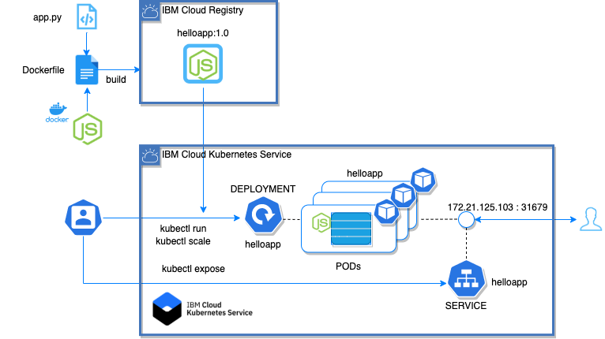

# IBM Kuberneteando sobre IBM Cloud Workshop

---
# Kuberneteando 3 - Kubernetes Hands-On
---

# Task 1 : Deploy a simple node app (optional)


## Step 1. Create and clone a github repo:

```
cd
mkdir kuberneteando3
cd kuberneteando3
git clone https://github.com/luisreyesoliva/kubelab
cd kubelab/lab1
```

For this tutorial, we have taken a simple Hello World! Node.js application to deploy on Kubernetes as shown. The following is code from our sample app; or you can use one that you have on hand.


``` javascript
  const app = require('express')()

  app.get('/', (req, res) => {
    res.send("Hola Kuberneteadores!");
  });

  var port = 3300;

  var server = app.listen(port, function () {
    console.log("Server listening on " + port);
  })

  module.exports.app = app;
```

## Step 2. Check your IBM Cloud registry:

```bash
ibmcloud cr api
```

Results

```bash
# ibmcloud cr api
                                       
Punto final de la API de Registry   https://us.icr.io/api   

OK
```

Take a note of the registry. In that case **us.icr.io**

## Step 3. Build and push it to IBM Cloud Container registry.

```
ibmcloud cr build -t us.icr.io/<yournamespace>/helloapp:1.0 .
```

Results

```bash
# ibmcloud cr build -t us.icr.io/lureyit/helloapp:1.0 .
Sending build context to Docker daemon  20.48kB
Step 1/7 : FROM node:alpine
 ---> 72eea7c426fc
Step 2/7 : COPY app.js /app/app.js
 ---> Using cache
 ---> 537ee7c5ca32
Step 3/7 : COPY package.json /app/package.json
 ---> Using cache
 ---> 002f9b657de0
Step 4/7 : RUN cd /app && npm install
 ---> Using cache
 ---> b5ba5ef4d994
Step 5/7 : ENV WEB_PORT 3300
 ---> Using cache
 ---> 6db8628e3442
Step 6/7 : EXPOSE  3300
 ---> Using cache
 ---> 12f699a0ac80
Step 7/7 : CMD ["node", "/app/app.js"]
 ---> Using cache
 ---> da101f3094f9
Successfully built da101f3094f9
Successfully tagged private.us.icr.io/lureyit/helloapp:1.0
The push refers to repository [private.us.icr.io/lureyit/helloapp]
ad2e32791b4d: Mounted from lureyit/nodeapp 
c052b726324c: Mounted from lureyit/nodeapp 
9a09d73e8af3: Mounted from lureyit/nodeapp 
846843578a94: Mounted from lureyit/nodeapp 
333d276b2ed4: Mounted from lureyit/nodeapp 
e4c8c61d9c2a: Mounted from lureyit/nodeapp 
3e207b409db3: Mounted from lureyit/nodeapp 
1.0: digest: sha256:3993247325b4dff016d9146546a9021a5650753a4f6dc148982bcd8e951e7c17 size: 1783

OK
```

## Step 4. Verify whether the image is uploaded to the container registry

```bash
ibmcloud cr images
```

```bash
# ibmcloud cr images
us.icr.io/lureyit/helloapp  1.0      3993247325b4   lureyit              4 minutes ago   49 MB    Sin problemas    
```

## Step 5. Deploy your application

In this part of the lab we will deploy an application called `helloapp` that has already been built and uploaded to IBM Cloud Registry under the name
`us.icr.io/<yournamespace>/helloapp:1.0`.

1. Start by running `helloapp`:

   ```$ kubectl run helloapp --image=us.icr.io/lureyit/helloapp:1.0```

   This action will take a bit of time. To check the status of the running application,
   you can use `$ kubectl get pods`.

   You should see output similar to the following:

   ```console
   $ kubectl get pods
   NAME                          READY     STATUS              RESTARTS   AGE
   helloapp-b8494f69c-r7k6v       0/1       ContainerCreating   0          1m
   ```
   Eventually, the status should show up as `Running`.
   
   ```console
   $ kubectl get pods
   NAME                          READY     STATUS              RESTARTS   AGE
   helloapp-b8494f69c-r7k6v       1/1       Running             0          1m
   ```
   
   The end result of the run command is not just the pod containing our application containers,
   but a Deployment resource that manages the lifecycle of those pods.
 
   
3. Once the status reads `Running`, we need to expose that deployment as a
   service so we can access it through the IP of the worker nodes.
   The `helloapp` application listens on port 3300.  Run:

   ```console
   $ kubectl expose deployment helloapp --type="NodePort" --port=3300
   service "helloapp" exposed
   ```

4. To find the port used on that worker node, examine your new service:

   ```console
   $ kubectl get service helloapp
   NAME        TYPE       CLUSTER-IP     EXTERNAL-IP   PORT(S)          AGE
   helloapp   NodePort   172.21.125.103   <none>       3300:31749/TCP   1m
   ```
   
   We can see that our `<nodeport>` is `31749`. We can see in the output the port mapping from 3300 inside 
   the pod exposed to the cluster on port 31749. This port in the 31000 range is automatically chosen, 
   and could be different for you.

5. `helloapp` is now running on your cluster, and exposed to the internet. We need to find out where it is accessible.
   The worker nodes running in the container service get external IP addresses.
   
   Run `$ ibmcloud ks workers --cluster <name-of-cluster>`, and note the public IP listed on the `<public-IP>` line.
   
   ```console
   $ ibmcloud ks workers --cluster clusterK8s
    OK
    ID                                                      IP pública      IP privada     Tipo   Estado   Estado   Zona           Versión 
    kube-bqts6kqd0a4g1lu66rkg-clusterk8s-default-000000c7   173.193.82.25   10.77.143.60   free   normal   Ready    hou02         1.16.9_1531   

   ```
   
   We can see that our `<public-IP>` is `173.193.82.25`.
   
6. Now that you have both the address and the port, you can now access the application in the web browser
   at `<public-IP>:<nodeport>`. In the example case this is `173.193.82.25:31749`.
   
Congratulations, you've now deployed an application to Kubernetes!




## Step 6. Scale apps with replicas

A *replica* is a copy of a pod that contains a running service. By having
multiple replicas of a pod, you can ensure your deployment has the available
resources to handle increasing load on your application.

1. `kubectl` provides a `scale` subcommand to change the size of an
   existing deployment. Let's increase our capacity from a single running instance of
   `guestbook` up to 10 instances:

   ``` console
   $ kubectl scale --replicas=3 deployment helloapp
   deployment "helloapp" scaled
   ```

   Kubernetes will now try to make reality match the desired state of
   10 replicas by starting 9 new pods with the same configuration as
   the first.

4. To see your changes being rolled out, you can run:
   `kubectl rollout status deployment helloapp`.

   The rollout might occur so quickly that the following messages might
   _not_ display:

   ```console
   $ kubectl rollout status deployment helloapp
   Waiting for rollout to finish: 1 of 3 updated replicas are available...
   Waiting for rollout to finish: 2 of 3 updated replicas are available...
   deployment "helloapp" successfully rolled out
   ```

5. Once the rollout has finished, ensure your pods are running by using:
   `kubectl get pods`.

   You should see output listing 10 replicas of your deployment:

   ```console
   $ kubectl get pods
   NAME                        READY     STATUS    RESTARTS   AGE
   helloapp-b8494f69c-r7k6v     1/1     Running   0          20m
   helloapp-b8494f69c-rmc67     1/1     Running   0          43s
   helloapp-b8494f69c-vxpvg     1/1     Running   0          43s
   ```

**Tip:** Another way to improve availability is to
[add clusters and regions](https://console.bluemix.net/docs/containers/cs_planning.html#cs_planning_cluster_config)
to your deployment, as shown in the following diagram:


## Step 7. Update and roll back apps

Kubernetes allows you to do rolling upgrade of your application to a new
container image. This allows you to easily update the running image and also allows you to
easily undo a rollout if a problem is discovered during or after deployment.

In the previous lab, we used an image with a `1.0` tag. For our upgrade
we'll change the app.js code 

``` javascript
  const app = require('express')()

  app.get('/', (req, res) => {
    res.send("<YOUR CHANGE HERE>");
  });

  var port = 3300;

  var server = app.listen(port, function () {
    console.log("Server listening on " + port);
  })

  module.exports.app = app;
```

and push a new version of the image with the `2.0` tag.

`$ ibmcloud cr build -t us.icr.io/<yournamespace>/helloapp:2.0 `


To update and roll back:
1. Using `kubectl`, you can now update your deployment to use the
   `2.0` image. `kubectl` allows you to change details about existing
   resources with the `set` subcommand. We can use it to change the
   image being used.

    ```$ kubectl set image deployment/helloapp helloapp=us.icr.io/lureyit/helloapp:2.0```

   Note that a pod could have multiple containers, each with its own name.
   Each image can be changed individually or all at once by referring to the name.
   In the case of our `helloapp` Deployment, the container name is also `helloapp`.
   Multiple containers can be updated at the same time.
   ([More information](https://kubernetes.io/docs/user-guide/kubectl/kubectl_set_image/).)

3. Run `kubectl rollout status deployment/helloapp` to check the status of
   the rollout. The rollout might occur so quickly that the following messages
   might _not_ display.

4. Test the application as before, by accessing `<public-IP>:<nodeport>` 
   in the browser to confirm your new code is active.

5. If you want to undo your latest rollout, use:
   ```console
   $ kubectl rollout undo deployment helloapp
   deployment.apps/helloapp rolled back
   ```
   
6. When doing a rollout, you see references to *old* replicas and *new* replicas.
   The *old* replicas are the original 3 pods deployed when we scaled the application.
   The *new* replicas come from the newly created pods with the different image.
   All of these pods are owned by the Deployment.
   The deployment manages these two sets of pods with a resource called a ReplicaSet.
   We can see the guestbook ReplicaSets with:
   ```console
   $ kubectl get replicasets -l run=guestbook
   NAME                   DESIRED   CURRENT   READY     AGE
   guestbook-5f5548d4f    10        10        10        21m
   guestbook-768cc55c78   0         0         0         3h
   ```

Before we continue, let's delete the application so we can learn about
a different way to achieve the same results:

 To remove the deployment, use `kubectl delete deployment helloapp`.

 To remove the service, use `kubectl delete service helloapp`.

Congratulations! Lab 1 is now complete.

# End of the lab

------

# Kuberneteando 3 - Kubernetes Hands-On

------
